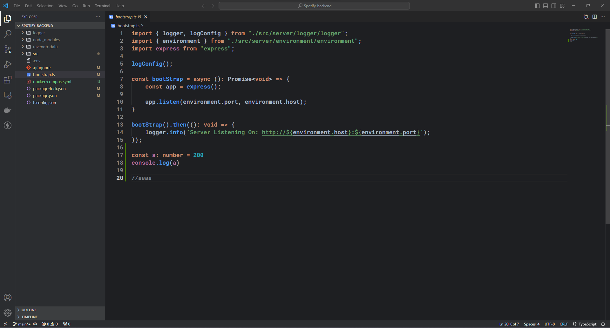

# Duck Themes VS Code Theme and Icons

Welcome to the repository for my theme Visual Studio Code theme and icons! This theme is designed to provide a visually pleasing and productive coding experience in VS Code. Additionally, it includes custom icons to enhance the overall look and feel of your workspace.

## Features

- **Custom Theme**: A carefully crafted theme that offers a unique color scheme for code syntax highlighting, making your code easier to read and understand.

- **Custom Icons**: A set of custom icons for files, folders, and various UI elements in Visual Studio Code, providing a more personalized and visually appealing workspace.

- **Syntax Highlighting**: The theme includes syntax highlighting for a wide range of programming languages, making it suitable for different coding tasks.

- **Enhanced Readability**: Improved readability with carefully selected font styles and colors to reduce eye strain during long coding sessions.

## Installation

1. **Download the Repository**: Clone or download this repository to your local machine.

2. **Install the Theme**:
   - Open Visual Studio Code.
   - Navigate to `Extensions` (Ctrl+Shift+X).
   - Search for `Duck Themes` and install it.
   - Set the theme as your default theme by clicking the gear icon in the lower-right corner and selecting it from the list.

4. **Enjoy Your Customized Workspace**: Your theme and icons are now applied! Customize further by tweaking the VS Code settings if needed.

## Screenshots

## Contributing

If you'd like to contribute to this theme or report issues, please visit the [GitHub repository](https://github.com/SrPatoS/DuckThemes-VSCode.git).

## License

This project is licensed under the MIT License. See the [LICENSE](LICENSE) file for details.

## Acknowledgments

- Thanks to the creators of Visual Studio Code and the community for making this customization possible.

---

Happy coding with your custom VS Code theme and icons! 🚀
